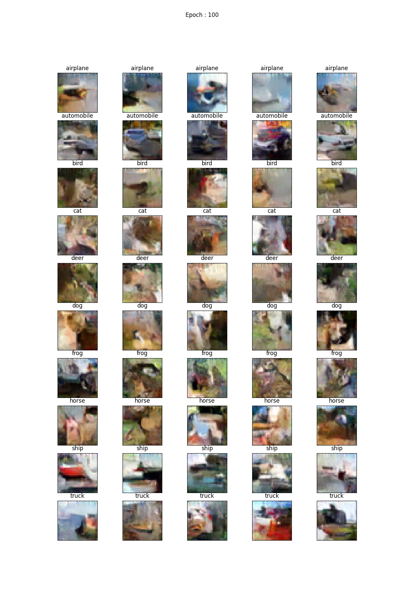
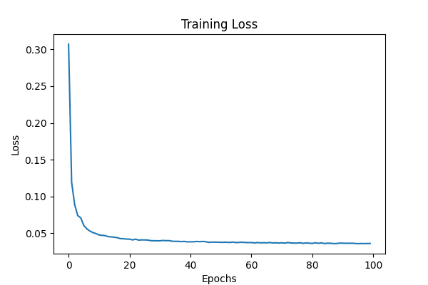
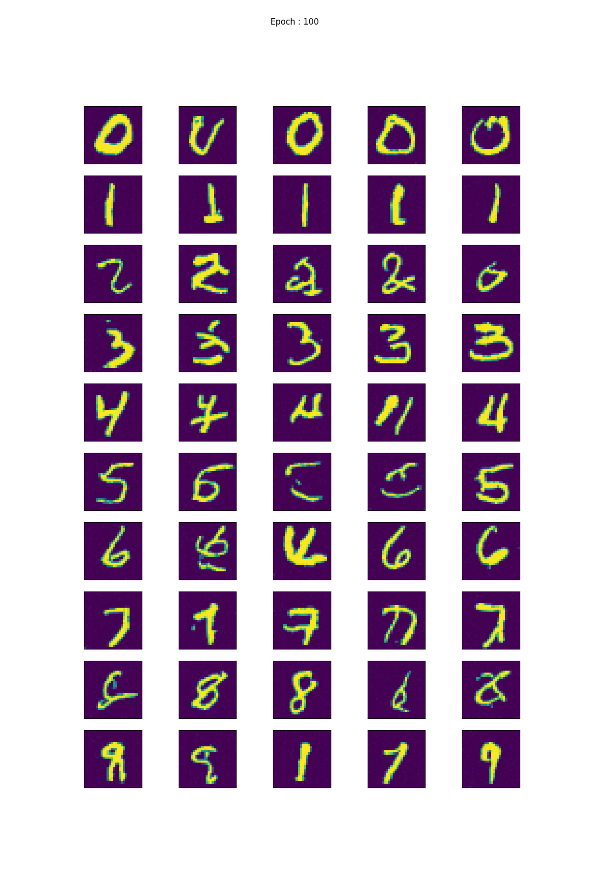
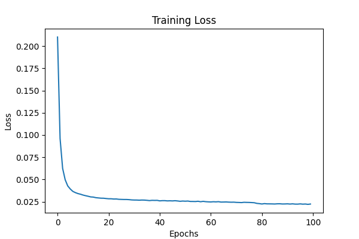

# Diffusion Model
Implementation for [Denoising Diffusion Probabilistic Models](https://arxiv.org/pdf/2006.11239.pdf). 
The goal is to implement the models from scratch including the U-Net architecture and experiment with other architecture understanding what is happening in the Diffusion Models [and hopefully try to explain it to you as well !:\)]

## Datasets
I have used 2 datasets for the experimentation :
* [Mnist](https://www.kaggle.com/datasets/hojjatk/mnist-dataset)  : Hand written digits
* [Cifar-10](https://www.cs.toronto.edu/~kriz/cifar.html) : Images belonging to 10 classes
In order to replicate, please download them from the above links. Unzip the files and store them in the data dfirectory in the folder **data/mnist/** and **data/cifar-10/**

## Models
There are two models :
* **SimplifiedModel** : This is a simple model comprising of CNN and without attention or the usual standard UNet model that is followed. It however does have a class embedding and a 2D positional embedding. It also supports generating conditional distribution given the class label. You can find the model architecture [SimplifiedModel.py](model/SimplifiedModel.py)
* TO DO (Some complicated modelling)

## Results
### Simplified model 
#### Cifar-10  
  

#### MNIST
 